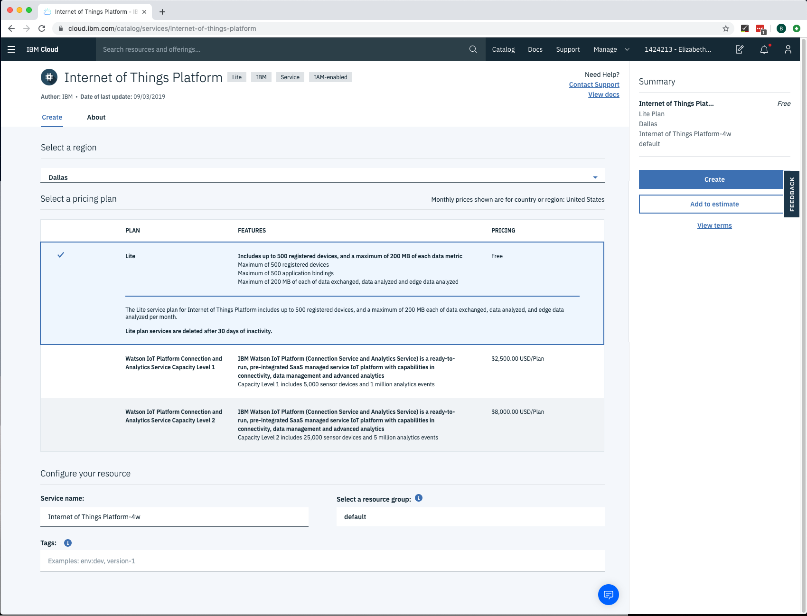
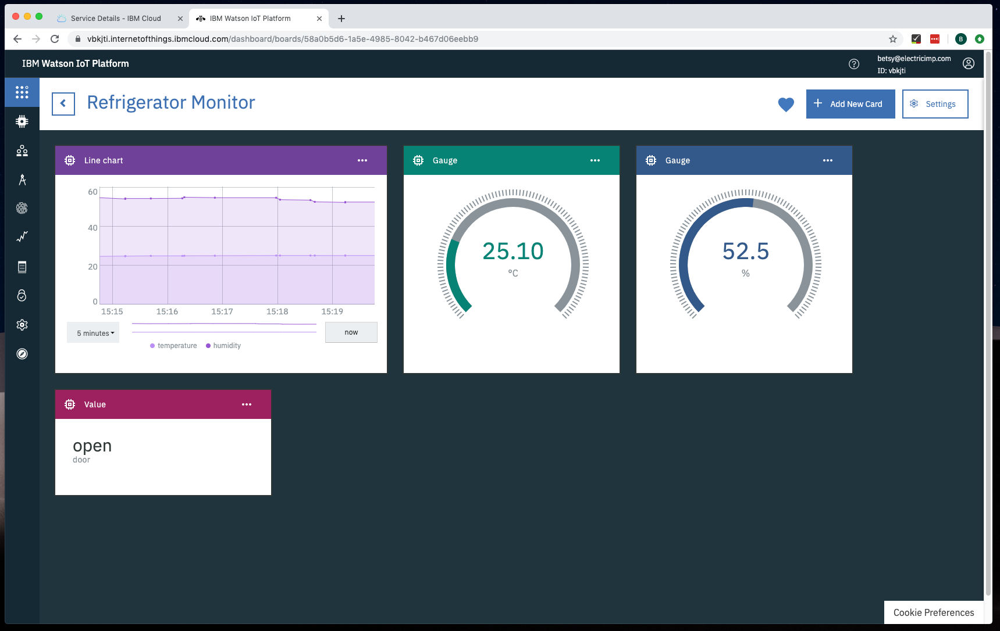

# Electric Imp Smart Refrigerator

Create a connected refrigerator using an Electric Imp and the IBM Watson IoT platform.

## Overview
Skill Level: Beginner

Below are detailed steps on how to connect an Electric Imp with environmental sensors to the Watson IoT Platform in order to visualize and monitor your refrigerator in real time.

## Ingredients

 1. Your WIFI *network name* and *password*
 2. A computer with a web browser
 3. Smartphone with the Electric Imp app ([iOS](https://itunes.apple.com/us/app/electric-imp/id547133856) or [Android](https://play.google.com/store/apps/details?id=com.electricimp.electricimp))
 4. A free [Electric Imp developer account](https://ide.electricimp.com/login)
 5. A [IBM Cloud account](https://console.ng.bluemix.net/registration/)
 6. An Electric Imp Explorer kit - [order here](https://store.electricimp.com/collections/featured-products/products/impexplorer-developer-kit-for-ibm-watson-iot?variant=31721381266)
 7. Three AA batteries

## Step-by-step

### Step 1 - What is demonstrated in this example?
Use an Electric Imp to collect temperature, humidity, accelerometer and light sensor data.  Analyze the sensor data to determine if your refrigerator compressor is working properly and to track if your refrigerator door has been left open.  Upload data to the Watson IoT platform to monitor and visualize your refrigerator in real time.

### Step 2 - Create a Watson IoT Service

Open [IBM Cloud IoT](https://cloud.ibm.com/catalog?category=iot) page in your web browser and log into your IBM account.

**Note:** If you have not created an organization, a pop up will walk you through the steps for creating an organization and space. When you are done click [this link](https://cloud.ibm.com/catalog?category=iot) to get back to Catalog IoT page.

On the [IBM Cloud IoT Catalog](https://cloud.ibm.com/catalog?category=iot) page select **Internet of Things Platform** to open the form to create a project.

To *Create a Project* enter the following information

1. Under *Select a region* leave the region auto-selected for you or select the region closest to your location
1. Under *Select a pricing plan* you can leave set to the free **Lite** plan (Please note you can only have ONE Lite plan application created at a time) 
1. Under *Configure your resource* you can leave the defaults or you can update the *Service Name* to give it an identifying name like *Electric Imp Smart Refrigerator*, no need to update tags or 
1. When you are done, in the right side bar **Create**

After a few seconds you should be redirected to your newly created IoT resource's home page. From that there click the *Launch* button to open a tab for this resource's dashboards.

Once you are in the service dashboard, there are 3 items you need to copy down. These will need to be pasted into the code during **Step 4**, your **Organization ID**, **API Key**, and **Authentication Token**.

1. Locating your **Organization ID**

  Select *Settings* tab in the sidebar
  

  Under *General* make a note or you **Organization ID**
  

2. Locating your **API Key** & **Authentication Token**

  Select *Apps* tab in the sidebar. Make sure you are in the **API Keys** tab, then click the **+ Generate API Key** button.
  

  In the Generate API Key form: 
  - Enter a description for your API key, ie *Imp Devices*
  - Click **Next**
  
  - Grant the API key permissions, by selecting *Standard Application* from the dropdown
  - Click **Generate Key**
  

  Make note of your **API Key** & **Authentication Token**
  
  *Note*: The **Authentication Token** can only be viewed when generating an API Key, you must store a copy of the **Authentication Token** before leaving this screen.

  When you have copied down your key and token you can proceed to the next steps.

### Step 3 - Connect your Electric Imp to the Internet

#### Set Up Hardware

1. Plug the Imp001 into the Explorer Kit Board
3. Power up your Imp with the AA batteries.

When the imp is first powered on it will blink amber/red.

#### Electric Imp BlinkUp

Use the Electric Imp mobile app to BlinkUp your device

1. In the app log into your Electric Imp developer account
2. Enter your WIFI credentials
3. Follow the instructions in the app to BlinkUp your device

When BlinkUp is successful the imp will blink green and the app will show you the device's unique ID.

For more information on BlinkUp visit the Electric Imp [Dev Center](https://electricimp.com/docs/gettingstarted/blinkup/).

### Step 4 - Connect your Electric Imp to Watson IoT

In your web browser log into the [Electric Imp IDE](https://impcentral.electricimp.com/login) using your Electric Imp developer account.

Create a new Product and Device Group, giving them names like *Smart Refrigerator* and *IBM integration*. Then assign your device to the Device Group. See the [getting started guide](https://developer.electricimp.com/gettingstarted/explorer/helloworld) in the Electric Imp dev center for details. When you are ready to enter code into the impCentral IDE return to these instructions. 

To get you started we have some example code for an IBM Watson Smart Refrigerator.  This code can be found in Electric Imp's [IBMWatson Github repository](https://github.com/electricimp/IBMWatson/tree/master/Examples/SmartRefrigerator).

Copy and paste the IBM Watson Smart Refrigerator example code into the agent and device coding windows. The agent.nut file should go in the agent coding window, the device.nut file in the device coding window.

Scroll the the bottom of the agent code to find *Watson API Auth Keys* variables. Enter your **API Key**, **Authentication Token**, and **Organization ID** from **Step 2** into the corresponding variables.

Click **Build and Force Restart** to save and launch the code on your device.

### 5.  Create Visualizations In the Watson IoT Dashboard

#### Create Board

Open up your IBM Watson IoT service dashboard, use the sidebar to navigate to **Boards**. Then click **+ Create New Board** button.

1. Enter Board Name (ie Refrigerator Monitor)
2. Enter a Description (optional)
3. Select **Make this board my landing page**
4. Select **Favorite**
5. Click **Next**
6. Add Users if desired, then Click **Create**

Select the Board you just created from **Your Boards** section.

**Note**: To complete this step we need a device to be configured in Watson. An Imp running the example code will create a device programatically, so if you have not completed **Step 4 - Connect your Electric Imp to Watson**, please do so before continuing.

Once your device is connected confirm it is sending data to IBM. Navigate to the devices tab in the sidebar. Under *Browse* all devices will be listed. Find the device that matches your device ID. Select it and look under *Recent Events* to confirm your device is sending data.

#### Create Cards

We are going to add a couple different types of cards to our board, a *Line chart* to track the temperature and humidity of the refrigerator, two *gauges* to show the current temperature and humidity, and a *value* card to show the current status of the refrigerator door.

To add new cards follow the step by step instructions below.

##### Line chart
Click **+Add New Card** button

1. Under **Devices** section and select **Line chart**
2. Select your device and click **Next**
3. Click **Connect new data set**
    - *Event* : select **RefrigeratorMonitor**
    - *Property* : select **temperature**
    - *Name* : Enter **Temperature**
    - *Type* : select **Number**
    - *Unit* : select **°C**
4. Click **Connect new data set**
    - *Event* : select **RefrigeratorMonitor**
    - *Property* : select **humidity**
    - *Name* : Enter **Humidity**
    - *Type* : select **Number**
    - *Unit* : select **%**
5. Click **Next**
6. Under *Settings* select **XL** and click **Next**
7. Enter a *Title* and *Description* (optional)
8. Select a *Color scheme* (optional)
9. Click **Submit**

##### Temperature gauge

Click **+Add New Card** button

1. Under **Devices** section select **Gauge**
2. Select your device and click **Next**
3. Click **Connect new data set**
    - *Event* : select **RefrigeratorMonitor**
    - *Property* : select **temperature**
    - *Name* : Enter **Temperature**
    - *Type* : select **Number**
    - *Unit* : select **°C**
4. Click **Next**
5. Under *Settings* select **M** and click **Next**
6. Enter a *Title* and *Description* (optional)
7. Select a *Color scheme* (optional)
8. Click **Submit**

##### Humidity gauge
Click **+Add New Card** button. Then repeat *Create Temperature gauge* steps, but replace step 3 with step below.

3. Click **Connect new data set**
  - *Event* : select **RefrigeratorMonitor**
  - *Property* : select **humidity**
  - *Name* : Enter **Humidity**
  - *Type* : select **Number**
  - *Unit* : select **%**

##### Door gauge

Click **+Add New Card** button

1. Under **Devices** section select **Value**
2. Select your device and click **Next**
3. Click **Connect new data set**
  - *Name* : Enter **Door Status**
  - *Event* : select **RefrigeratorMonitor**
  - *Property* : select **door**
  - *Type* : select **text**
4. Click **Next**
5. Under *Settings* select **M** and click **Next**
6. Enter a *Title* and *Description* (optional)
7. Select a *Color scheme* (optional)
8. Click **Submit**

Your final dashboard should look like this:

### 6.  Install the Imp in your Refrigerator

Open your refrigerator and place the Imp on a shelf in the door.

### 7.  Optional Improvements

Your refrigerator is now connected to the internet. As you begin to gather data for your refrigerator you should adjust the static variables in your device SmartFridgeApp class to further customize your integration.

* Adjust the temperature, humidity, and lighting thresholds to optimize for your refrigerator
* Adjust the reading and reporting times to optimize power usage
